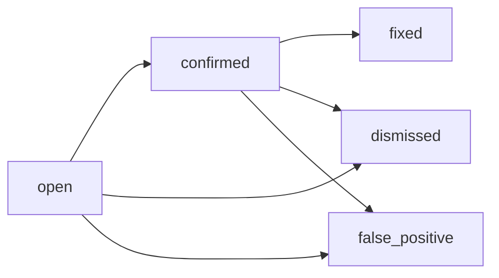

## Endpoint

Updates the status of a finding. This endpoint is used to track the lifecycle of security findings through various states.

## Authentication

Requires a valid session token via:
- `Authorization: Bearer <token>` header, or
- `heimdall_session` cookie

## Path Parameters

<ParamField path="id" type="string" required>
  Finding ID (UUID)
</ParamField>

## Request Body

<ParamField body="status" type="string" required>
  New status for the finding. Must be one of:
  - `open` - Finding is active and unresolved
  - `confirmed` - Finding has been confirmed as a real vulnerability
  - `dismissed` - Finding is being tracked but not prioritized
  - `false_positive` - Finding is not a real vulnerability
  - `fixed` - Finding has been remediated
</ParamField>

<ParamField body="comment" type="string">
  Optional comment explaining the status change
</ParamField>

## Example Request

<CodeGroup>

```bash cURL
curl -X PATCH https://heimdall.example.com/api/findings/01932e4a-7b2c-7890-abcd-1234567890ab/status \
  -H "Authorization: Bearer <token>" \
  -H "Content-Type: application/json" \
  -d '{
    "status": "confirmed",
    "comment": "Verified the SQL injection vulnerability in production logs"
  }'
```

```javascript JavaScript
const response = await fetch(
  'https://heimdall.example.com/api/findings/01932e4a-7b2c-7890-abcd-1234567890ab/status',
  {
    method: 'PATCH',
    headers: {
      'Authorization': 'Bearer <token>',
      'Content-Type': 'application/json'
    },
    body: JSON.stringify({
      status: 'confirmed',
      comment: 'Verified the SQL injection vulnerability in production logs'
    })
  }
);

const result = await response.json();
```

```python Python
import requests

response = requests.patch(
    'https://heimdall.example.com/api/findings/01932e4a-7b2c-7890-abcd-1234567890ab/status',
    headers={'Authorization': 'Bearer <token>'},
    json={
        'status': 'confirmed',
        'comment': 'Verified the SQL injection vulnerability in production logs'
    }
)

print(response.json())
```

</CodeGroup>

## Response

### Success Response

<ResponseField name="success" type="boolean">
  Always `true` for successful updates
</ResponseField>

<ResponseField name="data" type="object">
  Updated finding object with all fields
</ResponseField>

```json
{
  "success": true,
  "data": {
    "id": "01932e4a-7b2c-7890-abcd-1234567890ab",
    "scan_id": "01932e49-1234-7890-abcd-1234567890ab",
    "title": "SQL Injection in login endpoint",
    "status": "confirmed",
    "severity": "critical",
    "confidence": "high",
    "source": "ai",
    "file_path": "src/routes/auth.rs",
    "line_start": 145,
    "line_end": 152,
    "description": "Unsanitized user input in SQL query...",
    "updated_at": "2026-03-12T15:30:00Z"
  }
}
```

### Error Responses

<AccordionGroup>
  <Accordion title="400 Bad Request - Invalid status">
    ```json
    {
      "success": false,
      "error": {
        "code": 400,
        "message": "Unsupported finding status: invalid_status"
      }
    }
    ```
  </Accordion>

  <Accordion title="404 Not Found">
    ```json
    {
      "success": false,
      "error": {
        "code": 404,
        "message": "Finding '01932e4a-7b2c-7890-abcd-1234567890ab' not found"
      }
    }
    ```
  </Accordion>

  <Accordion title="500 Internal Server Error">
    ```json
    {
      "success": false,
      "error": {
        "code": 500,
        "message": "Failed to update finding status"
      }
    }
    ```
  </Accordion>
</AccordionGroup>

## Status Workflow

Typical finding lifecycle:



## Events

Status changes automatically create a `status_change` event in the finding's audit trail, accessible via the [Get Finding Events](/api/findings/comments) endpoint.

## Related Endpoints

- [Get Finding](/api/findings/get) - Retrieve complete finding details
- [Update Severity](/api/findings/update-severity) - Change finding severity
- [Get Finding Events](/api/findings/comments) - View finding audit trail
