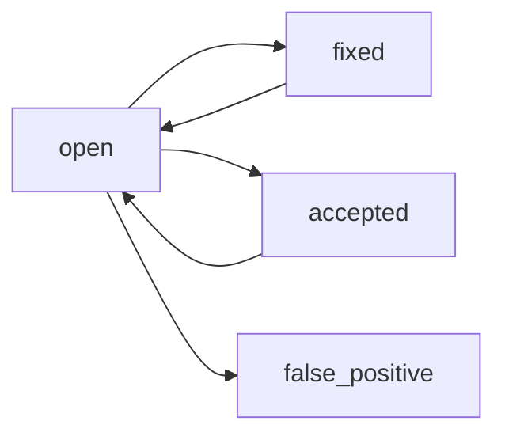

Heimdall findings represent discovered security vulnerabilities and logic flaws. Each finding contains rich metadata, remediation guidance, and a complete audit trail from discovery to resolution.

## Finding Structure

Findings are stored in the `findings` table with comprehensive metadata:

```sql schema
CREATE TABLE findings (
  id UUID PRIMARY KEY,
  scan_id UUID REFERENCES scans(id),
  repo_id UUID REFERENCES repos(id),
  
  -- Classification
  source VARCHAR(50) NOT NULL,           -- 'ai', 'semgrep', 'taint', 'config'
  severity VARCHAR(20) NOT NULL,         -- 'critical', 'high', 'medium', 'low'
  confidence VARCHAR(20) NOT NULL,       -- 'high', 'medium', 'low'
  status VARCHAR(20) DEFAULT 'open',     -- 'open', 'fixed', 'accepted', 'false_positive'
  
  -- Details
  title VARCHAR(500) NOT NULL,
  description TEXT,
  cwe_id VARCHAR(20),                    -- e.g., 'CWE-89'
  
  -- Location
  file_path VARCHAR(1000) NOT NULL,
  line_start INTEGER NOT NULL,
  line_end INTEGER,
  code_snippet TEXT,
  
  -- Evidence
  fingerprint VARCHAR(64) UNIQUE,        -- SHA256 hash for deduplication
  agent_reasoning TEXT,                  -- Step-by-step investigation notes
  
  -- Validation
  poc_validated BOOLEAN DEFAULT false,   -- Garmr confirmed exploitability
  poc_exploit_json JSONB,               -- PoC script and results
  
  -- Remediation
  suggested_patch TEXT,                  -- Unified diff format
  
  created_at TIMESTAMPTZ DEFAULT now(),
  updated_at TIMESTAMPTZ DEFAULT now()
);
```

## Severity Levels

Heimdall uses a four-tier severity system:

<Tabs>
  <Tab title="Critical">
    **Definition:** Immediate threat to confidentiality, integrity, or availability. Exploitable without authentication.
    
    **Examples:**
    - SQL injection in public API
    - Authentication bypass
    - Remote code execution
    - Hardcoded admin credentials
    - Insecure deserialization
    
    **Response Time:** Fix within 24 hours
    
    **Risk:** Complete system compromise possible
  </Tab>
  
  <Tab title="High">
    **Definition:** Significant security risk requiring prompt remediation. May require authentication or specific conditions.
    
    **Examples:**
    - IDOR (Insecure Direct Object Reference)
    - Privilege escalation
    - Sensitive data exposure
    - SSRF (Server-Side Request Forgery)
    - Path traversal
    
    **Response Time:** Fix within 7 days
    
    **Risk:** User data compromise or lateral movement possible
  </Tab>
  
  <Tab title="Medium">
    **Definition:** Security issue that reduces overall posture but requires multiple steps to exploit.
    
    **Examples:**
    - Username enumeration
    - Missing rate limiting
    - Weak password policy
    - Information disclosure (non-sensitive)
    - Logic flaws with low impact
    
    **Response Time:** Fix within 30 days
    
    **Risk:** Could be chained with other vulnerabilities
  </Tab>
  
  <Tab title="Low">
    **Definition:** Security concern with minimal immediate risk or exploitability.
    
    **Examples:**
    - Missing security headers
    - Verbose error messages
    - Outdated dependencies (no known CVEs)
    - Code quality issues
    - Non-security logic bugs
    
    **Response Time:** Fix in next release cycle
    
    **Risk:** Minimal direct impact, may enable future attacks
  </Tab>
</Tabs>

<Info>
  Severity is initially assigned by the Hunt agent or static analyzer, then refined by Víðarr (adversarial verification) and Garmr (sandbox validation).
</Info>

## Confidence Levels

Confidence indicates certainty that the finding is a true positive:

| Confidence | Definition | Example |
|------------|------------|----------|
| **High** | Validated by Garmr PoC or obvious pattern | SQL injection confirmed with working exploit |
| **Medium** | Strong evidence but not validated | AI agent traced input to SQL query without seeing parameterization |
| **Low** | Potential issue requiring manual review | Static pattern matched but context unclear |

<Note>
  Findings with `poc_validated = true` **always** have high confidence, regardless of the original assessment.
</Note>

## Finding Sources

The `source` field indicates which stage discovered the finding:

<AccordionGroup>
  <Accordion title="ai" icon="brain">
    **Stage:** Hunt (agentic discovery)
    
    **Characteristics:**
    - Context-aware vulnerabilities
    - Logic flaws
    - Business logic issues
    - Complex data flow analysis
    
    **Confidence:** Starts at medium, upgraded by Víðarr/Garmr
  </Accordion>
  
  <Accordion title="semgrep" icon="magnifying-glass">
    **Stage:** Static Analysis
    
    **Characteristics:**
    - Pattern-based detection
    - Known vulnerability signatures
    - Fast and deterministic
    - May have false positives
    
    **Confidence:** Medium (requires manual review)
  </Accordion>
  
  <Accordion title="taint" icon="droplet">
    **Stage:** Taint Analysis
    
    **Characteristics:**
    - Data flow from source to sink
    - Input validation gaps
    - Sanitization failures
    - Cross-function taint propagation
    
    **Confidence:** Medium to high (depends on flow confidence)
  </Accordion>
  
  <Accordion title="config" icon="file-lines">
    **Stage:** Config Scan
    
    **Characteristics:**
    - IaC misconfigurations
    - Weak security settings
    - Missing encryption
    - Overly permissive policies
    
    **Confidence:** High (objective checks)
  </Accordion>
</AccordionGroup>

## Viewing Findings

Access findings through the API:

<CodeGroup>
```bash cURL
curl https://app.heimdall.security/api/v1/scans/{scan_id}/findings \
  -H "Authorization: Bearer YOUR_TOKEN"
```

```typescript SDK
const findings = await heimdall.scans.listFindings(scanId, {
  severity: 'critical',
  status: 'open',
  limit: 50
});

for (const finding of findings) {
  console.log(`${finding.severity.toUpperCase()}: ${finding.title}`);
  console.log(`  Location: ${finding.file_path}:${finding.line_start}`);
  console.log(`  Validated: ${finding.poc_validated ? '✓' : '✗'}`);
}
```

```sql PostgreSQL
SELECT 
  severity,
  title,
  file_path,
  line_start,
  confidence,
  poc_validated,
  status
FROM findings
WHERE scan_id = 'YOUR_SCAN_ID'
  AND status = 'open'
ORDER BY 
  CASE severity
    WHEN 'critical' THEN 0
    WHEN 'high' THEN 1
    WHEN 'medium' THEN 2
    WHEN 'low' THEN 3
  END,
  poc_validated DESC,  -- Validated findings first
  created_at DESC;
```
</CodeGroup>

## Applying Patches

Some findings include AI-generated patches in unified diff format:

```sql
SELECT suggested_patch
FROM findings
WHERE id = 'YOUR_FINDING_ID';
```

**Example patch:**

```diff
--- src/api/search.rs
+++ src/api/search.rs
@@ -45,7 +45,8 @@
 async fn search_users(query: Query<SearchParams>) -> Result<Json<Vec<User>>> {
-    let sql = format!("SELECT * FROM users WHERE username LIKE '%{}%'", query.q);
-    let users = sqlx::query_as::<_, User>(&sql)
+    // Use parameterized query to prevent SQL injection
+    let users = sqlx::query_as::<_, User>(
+        "SELECT * FROM users WHERE username LIKE $1")
+        .bind(format!("%{}%", query.q))
         .fetch_all(&state.db)
         .await?;
     Ok(Json(users))
```

### Apply via API

<CodeGroup>
```bash cURL
curl -X POST https://app.heimdall.security/api/v1/findings/{finding_id}/apply-patch \
  -H "Authorization: Bearer YOUR_TOKEN" \
  -H "Content-Type: application/json" \
  -d '{
    "commit_message": "fix: prevent SQL injection in user search",
    "create_branch": true,
    "branch_name": "heimdall/fix-sql-injection-search"
  }'
```

```typescript SDK
await heimdall.findings.applyPatch(findingId, {
  commitMessage: 'fix: prevent SQL injection in user search',
  createBranch: true,
  branchName: 'heimdall/fix-sql-injection-search'
});

// Returns:
// {
//   success: true,
//   branch: 'heimdall/fix-sql-injection-search',
//   commit_sha: 'abc123...',
//   pull_request_url: 'https://github.com/org/repo/pull/42'
// }
```
</CodeGroup>

<Warning>
  Always review AI-generated patches before merging. They may not account for all edge cases or architectural constraints.
</Warning>

### Manual Application

Download the patch and apply locally:

```bash
# Download patch
curl https://app.heimdall.security/api/v1/findings/{finding_id}/patch \
  -H "Authorization: Bearer YOUR_TOKEN" \
  -o fix.patch

# Review
cat fix.patch

# Apply
git apply fix.patch

# Test
cargo test

# Commit
git add .
git commit -m "fix: apply Heimdall patch for SQL injection"
```

## Creating Issues

Heimdall can automatically create issues in your repository:

### Manual Issue Creation

<CodeGroup>
```bash cURL
curl -X POST https://app.heimdall.security/api/v1/findings/{finding_id}/create-issue \
  -H "Authorization: Bearer YOUR_TOKEN"
```

```typescript SDK
const issue = await heimdall.findings.createIssue(findingId);

console.log(`Created: ${issue.url}`);
// Output: Created: https://github.com/org/repo/issues/123
```
</CodeGroup>

Generated issue format:

```markdown
# [Heimdall] SQL injection in user search endpoint

**Severity:** Critical  
**Confidence:** High (validated)  
**CWE:** CWE-89 (SQL Injection)

## Description

The `search_users` function in `src/api/search.rs:45` constructs SQL queries using string formatting with unsanitized user input from the `q` query parameter. An attacker can inject arbitrary SQL commands to read, modify, or delete database contents.

## Location

- **File:** `src/api/search.rs`
- **Line:** 45-48
- **Endpoint:** `GET /api/users/search?q=<input>`

## Vulnerability Details

```rust
let sql = format!("SELECT * FROM users WHERE username LIKE '%{}%'", query.q);
let users = sqlx::query_as::<_, User>(&sql)
    .fetch_all(&state.db)
    .await?;
```

## Proof of Concept

```python
import requests

# Exfiltrate all users
payload = "' OR '1'='1"
response = requests.get(f"https://api.example.com/users/search?q={payload}")
print(response.json())  # Returns all users

# Drop users table
payload = "'; DROP TABLE users; --"
requests.get(f"https://api.example.com/users/search?q={payload}")
```

## Recommended Fix

Use parameterized queries:

```rust
let users = sqlx::query_as::<_, User>(
    "SELECT * FROM users WHERE username LIKE $1")
    .bind(format!("%{}%", query.q))
    .fetch_all(&state.db)
    .await?;
```

## References

- [OWASP: SQL Injection](https://owasp.org/www-community/attacks/SQL_Injection)
- [CWE-89: SQL Injection](https://cwe.mitre.org/data/definitions/89.html)
- [Heimdall Finding ID](https://app.heimdall.security/findings/{finding_id})

---
*This issue was automatically created by [Heimdall Security](https://heimdall.security)*
```

### Automatic Issue Creation

Enable auto-creation for high-severity findings:

```sql
UPDATE repos
SET 
  issue_auto_create_enabled = true,
  issue_auto_create_min_severity = 'high'  -- 'critical', 'high', 'medium', 'low'
WHERE id = 'YOUR_REPO_ID';
```

Configuration:

```typescript
await heimdall.repos.updateIssueSettings(repoId, {
  autoCreateEnabled: true,
  minSeverity: 'high',
  requiresValidation: true  // Only create for poc_validated = true
});
```

Automatic creation happens during the **Report** stage:

```rust src/pipeline/mod.rs
async fn auto_create_repo_issues(&self, repo: &Repo) {
    if !repo.issue_auto_create_enabled {
        return;
    }

    let qualifying_findings = findings
        .iter()
        .filter(|finding| {
            issues::finding_qualifies_for_auto_issue(
                finding,
                &repo.issue_auto_create_min_severity,
            )
        })
        .cloned()
        .collect::<Vec<Finding>>();

    for finding in qualifying_findings {
        match issues::create_or_link_issue(
            &self.db,
            self.encryption_key.as_ref(),
            repo,
            &finding,
            true, // auto_created = true
        ).await {
            Ok((repo_issue, was_created)) => {
                if was_created {
                    log::info!("Created issue: {}", repo_issue.issue_url);
                }
            }
            Err(e) => log::warn!("Issue creation failed: {e}"),
        }
    }
}
```

## Finding Events

Every finding has a complete audit trail in the `finding_events` table:

```sql schema
CREATE TABLE finding_events (
  id UUID PRIMARY KEY,
  finding_id UUID REFERENCES findings(id),
  user_id UUID REFERENCES users(id),
  event_type VARCHAR(50) NOT NULL,  -- 'status_changed', 'severity_changed', etc.
  old_value VARCHAR(500),
  new_value VARCHAR(500),
  comment TEXT,
  metadata JSONB,
  created_at TIMESTAMPTZ DEFAULT now()
);
```

### Event Types

| Event Type | Description | Triggered By |
|------------|-------------|-------------|
| `discovered` | Finding created during scan | Hunt, Static Analysis, etc. |
| `status_changed` | Status updated (open → fixed) | User action or patch application |
| `severity_changed` | Severity adjusted | Víðarr or user override |
| `validated` | PoC confirmed exploitability | Garmr |
| `false_positive_marked` | Marked as false positive | Víðarr or user |
| `issue_linked` | GitHub/GitLab issue created | Auto-creation or manual |
| `patch_applied` | Remediation patch applied | API or git integration |
| `comment_added` | User added note | User annotation |

### Query Event History

```sql
SELECT 
  fe.event_type,
  fe.old_value,
  fe.new_value,
  fe.comment,
  fe.metadata,
  u.display_name as user,
  fe.created_at
FROM finding_events fe
LEFT JOIN users u ON u.id = fe.user_id
WHERE fe.finding_id = 'YOUR_FINDING_ID'
ORDER BY fe.created_at ASC;
```

**Example timeline:**

| Event | User | Timestamp | Details |
|-------|------|-----------|----------|
| `discovered` | System | 2026-03-12 10:23:15 | Source: ai (Hunt agent) |
| `validated` | System | 2026-03-12 10:25:47 | Garmr confirmed with PoC |
| `issue_linked` | System | 2026-03-12 10:26:02 | Created GitHub issue #123 |
| `severity_changed` | alice@example.com | 2026-03-12 14:30:00 | high → critical (exploited in wild) |
| `patch_applied` | alice@example.com | 2026-03-12 15:45:22 | Applied via PR #124 |
| `status_changed` | alice@example.com | 2026-03-13 09:12:00 | open → fixed (merged and deployed) |

## Status Workflow

Findings progress through states:



<Tabs>
  <Tab title="open">
    **Definition:** Confirmed vulnerability requiring remediation
    
    **Actions:**
    - Investigate
    - Apply patch
    - Create issue
    - Change severity
  </Tab>
  
  <Tab title="fixed">
    **Definition:** Remediation deployed to production
    
    **Transition:** Set automatically when patch is applied or manually confirmed
    
    **Reversal:** Can reopen if vulnerability recurs in future scans
  </Tab>
  
  <Tab title="accepted">
    **Definition:** Risk acknowledged but not remediated (business decision)
    
    **Use Cases:**
    - Low-risk finding with high fix cost
    - Mitigated by external controls
    - Temporary workaround in place
    
    **Requires:** Comment explaining justification
  </Tab>
  
  <Tab title="false_positive">
    **Definition:** Not a real vulnerability (incorrect detection)
    
    **Causes:**
    - Missing context from static analysis
    - AI agent misinterpreted code
    - Validation on wrong code path
    
    **Effect:** Excluded from counts and reports
  </Tab>
</Tabs>

### Update Status

<CodeGroup>
```bash cURL
curl -X PATCH https://app.heimdall.security/api/v1/findings/{finding_id} \
  -H "Authorization: Bearer YOUR_TOKEN" \
  -H "Content-Type: application/json" \
  -d '{
    "status": "fixed",
    "comment": "Deployed fix in release v2.1.4"
  }'
```

```typescript SDK
await heimdall.findings.updateStatus(findingId, {
  status: 'fixed',
  comment: 'Deployed fix in release v2.1.4'
});
```

```sql PostgreSQL
UPDATE findings
SET status = 'fixed', updated_at = now()
WHERE id = 'YOUR_FINDING_ID';

INSERT INTO finding_events (finding_id, event_type, old_value, new_value, comment)
VALUES (
  'YOUR_FINDING_ID',
  'status_changed',
  'open',
  'fixed',
  'Deployed fix in release v2.1.4'
);
```
</CodeGroup>

## Fingerprinting & Deduplication

Each finding has a unique fingerprint based on:

```rust
fn make_fingerprint(title: &str, file: &str, line: i32) -> String {
    let input = format!("hunt:{title}:{file}:{line}");
    let mut hasher = Sha256::new();
    hasher.update(input.as_bytes());
    hex::encode(hasher.finalize())
}
```

This prevents duplicate findings across scans:

```sql
CREATE UNIQUE INDEX findings_fingerprint_idx ON findings(fingerprint);
```

If the same vulnerability appears in multiple scans, Heimdall:
1. Links to the original finding
2. Updates `last_seen_scan_id`
3. Creates a `finding_recurred` event

<Warning>
  Fingerprints are **line-number sensitive**. Refactoring code may create "new" findings for the same vulnerability.
</Warning>

## Next Steps

<CardGroup cols={2}>
  <Card title="Hunt Agent" icon="crosshairs" href="/features/hunt-agent">
    Learn how vulnerabilities are discovered
  </Card>
  <Card title="Sandbox Validation" icon="flask" href="/features/sandbox-validation">
    Understand PoC validation with Garmr
  </Card>
  <Card title="Scan Pipeline" icon="gears" href="/features/scan-pipeline">
    See the complete analysis workflow
  </Card>
  <Card title="Threat Modeling" icon="shield" href="/features/threat-modeling">
    Understand attack surface identification
  </Card>
</CardGroup>
