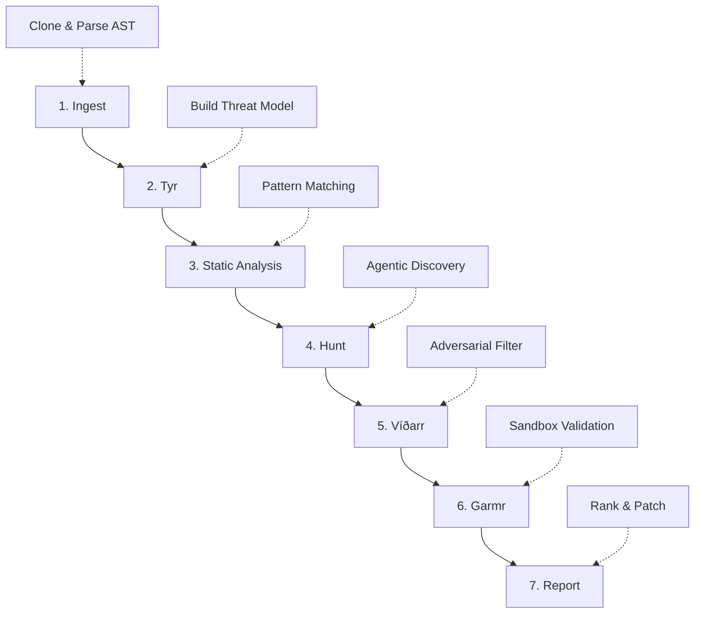

Heimdall is an **agentic, context-aware security scanner** that goes beyond traditional pattern matching. It builds a threat model of your application, deploys AI agents that reason about your codebase, validates findings in sandboxed environments, and produces ranked, actionable results with patches and proof-of-concept exploits.

## Overview

Every scan follows a deterministic 7-stage pipeline that progressively narrows from broad reconnaissance to precise vulnerability confirmation:



<Steps>
  <Step title="Ingest: Code Acquisition & Indexing">
    Heimdall clones your repository and builds a comprehensive code index using tree-sitter for AST parsing.

    ### What happens:
    - **Source acquisition**: Clones from GitHub, GitLab, public git URLs, or extracts uploaded zip archives
    - **Commit detection**: Resolves the current commit SHA for traceability
    - **File enumeration**: Walks the repository, filtering out `node_modules`, `.git`, build artifacts, etc.
    - **AST parsing**: Extracts symbols, functions, classes, and call graphs using tree-sitter
    - **Database snapshots**: Stores file content hashes and metadata for each scanned file

    ### Supported languages:
    - **Full symbol extraction**: Rust, Python, JavaScript, TypeScript, Go, Java
    - **Basic coverage**: Ruby, PHP (regex-based fallback)

    ### Example output:
    ```
    [scan_id] Indexed 342 files, 1,847 symbols
    ```

    The `CodeIndex` provides:
    - Symbol lookup by name, type, or file
    - Call graph traversal ("who calls this function?")
    - Dependency resolution (imports/requires)
    - Full-text regex search across all files

    <Note>
      Files larger than 1MB are skipped to avoid performance issues during parsing.
    </Note>
  </Step>

  <Step title="Tyr: Threat Model Generation">
    Named after the Norse god of justice, Tyr builds a structured threat model using STRIDE methodology.

    ### Phase 1: Reconnaissance
    Tyr performs static reconnaissance without any LLM calls:
    - **Tech stack detection**: Identifies frameworks from file extensions and imports (Actix-web, Flask, Express, etc.)
    - **Entry point discovery**: Finds `main()` functions, route handlers, public exports
    - **Route mapping**: Extracts API endpoints from decorators, macros, and framework patterns
    - **Security pattern detection**: Locates authentication, session management, encryption, SQL queries, file uploads
    - **Database access**: Identifies ORM usage and raw SQL execution
    - **Configuration analysis**: Finds environment variable usage and config files

    ### Phase 2: LLM Analysis
    Tyr sends reconnaissance data to the AI model with a prompt based on **STRIDE**:
    - **S**poofing — can an attacker impersonate another user?
    - **T**ampering — can data be modified without authorization?
    - **R**epudiation — are actions auditable?
    - **I**nformation Disclosure — can sensitive data leak?
    - **D**enial of Service — can the system be made unavailable?
    - **E**levation of Privilege — can an attacker gain higher permissions?

    ### Output structure:
    ```json
    {
      "summary": "2-3 paragraph overview of the application architecture and security posture",
      "boundaries": [
        {
          "name": "User Browser → API Server",
          "description": "Untrusted HTTP requests cross into the application layer",
          "from_zone": "Public Internet",
          "to_zone": "Application Server",
        }
      ],
      "surfaces": [
        {
          "name": "File Upload Endpoint",
          "description": "POST /api/upload accepts user files without validation, vulnerable to path traversal and malicious content",
          "endpoint": "/api/upload",
          "file": "src/routes/upload.rs",
          "risk_level": "high"
        }
      ],
      "data_flows": [
        {
          "name": "Password Reset Flow",
          "source": "User email input",
          "sink": "SMTP server",
          "sensitive_data": "Email addresses, reset tokens"
        }
      ]
    }
    ```

    The threat model is persisted to the database and drives the Hunt stage.

    <Accordion title="View Tyr System Prompt">
      ```
      You are Tyr, the threat model engine of Heimdall security scanner.
      Named after the Norse god of justice and law, you produce rigorous, structured threat models.

      Your analysis methodology follows STRIDE...
      - Reference actual files and endpoints from the codebase
      - Be concrete and specific
      - Every surface must have a risk_level reflecting real exploitability
      - Aim for completeness — missing a real attack surface is worse than including a low-risk one
      ```
    </Accordion>
  </Step>

  <Step title="Static Analysis: Pattern Matching & Secrets">
    Fast, deterministic checks using regex patterns and tree-sitter queries.

    ### Detection categories:
    - **Injection flaws**: SQL injection, command injection, XSS, LDAP injection, template injection
    - **Hardcoded secrets**: API keys, passwords, tokens, private keys, AWS credentials
    - **Crypto issues**: Weak algorithms (MD5, SHA1), hardcoded keys, insecure random
    - **Path traversal**: `../` patterns in file operations
    - **Unsafe deserialization**: `pickle.loads()`, `eval()`, `unserialize()`
    - **CSRF**: Missing CSRF tokens on state-changing endpoints
    - **Open redirects**: Unvalidated redirect destinations
    - **Dependency vulnerabilities**: Known CVEs from OSV database

    ### Example rule (SQL injection):
    ```rust
    let pattern = r#"execute\(.*\+.*\)"#; // String concatenation in SQL
    let matches = search_code_index(pattern);
    for match in matches {
        create_finding(
            "SQL Injection via String Concatenation",
            "high",
            match.file,
            match.line,
            "Use parameterized queries instead of string concatenation"
        );
    }
    ```

    Static analysis is **fast** (completes in seconds) and produces high-confidence findings for known patterns.
  </Step>

  <Step title="Hunt: Agentic Vulnerability Discovery">
    The Hunt stage deploys autonomous AI agents that **reason about code** like a security researcher.

    ### How it works:
    For each attack surface from Tyr's threat model, Hunt spawns a parallel investigation:

    ```rust
    for surface in threat_model.surfaces {
        tokio::spawn(async move {
            let agent = HuntAgent::new(scan_id, db, ai, model);
            agent.investigate(&surface, &code_index, &static_context).await
        });
    }
    ```

    ### Agent state machine:
    ```mermaid
    stateDiagram-v2
        [*] --> Planning
        Planning --> AwaitingLlm
        AwaitingLlm --> ExecutingTool: Tool call
        ExecutingTool --> AwaitingLlm: Results
        AwaitingLlm --> ReportingFinding: Found vuln
        ReportingFinding --> AwaitingLlm: Continue
        AwaitingLlm --> Completed: Done/Limit
        Completed --> [*]
    ```

    ### Available tools:
    | Tool | Purpose | Example |
    |------|---------|----------|
    | `read_file` | Read file contents (15KB truncation) | `{"path": "src/auth.rs"}` |
    | `search_code` | Regex search across codebase (30 results max) | `{"pattern": "password.*hash"}` |
    | `get_callers` | Find all call sites of a symbol | `{"symbol": "execute_query"}` |
    | `get_dependencies` | Get dependency graph for a file | `{"file": "routes/api.rs"}` |
    | `report_finding` | Report a discovered vulnerability | `{"title": "SQL Injection in /api/users", "severity": "critical", ...}` |

    ### Example investigation:
    <CodeGroup>
    ```json Surface: File Upload Handler
    {
      "name": "File Upload Endpoint",
      "endpoint": "/api/repos/upload",
      "file": "src/routes/repos.rs",
      "risk_level": "high",
      "description": "Processes zip file uploads from users"
    }
    ```

    ```plaintext Agent Actions
    1. read_file({"path": "src/routes/repos.rs"})
       → Reads upload handler code
    
    2. search_code({"pattern": "extract.*zip"})
       → Finds zip extraction logic in ingest stage
    
    3. read_file({"path": "src/pipeline/ingest/mod.rs"})
       → Discovers enclosed_name() check is missing
    
    4. report_finding({
         "title": "Zip Slip Path Traversal in Upload Handler",
         "severity": "critical",
         "file": "src/pipeline/ingest/mod.rs",
         "line": 273,
         "description": "Uploaded zip files are extracted without validating entry paths..."
       })
    ```
    </CodeGroup>

    ### Iteration limit:
    Each agent has a maximum of **25 iterations** to prevent infinite loops. Most investigations complete in 5-10 iterations.

    <Warning>
      Hunt agents investigate **security vulnerabilities and logic flaws** — not code style or performance issues.
    </Warning>
  </Step>

  <Step title="Víðarr: Adversarial Verification">
    Named after the silent Norse god of vengeance, Víðarr acts as a **skeptical judge** that tries to **disprove** every finding.

    ### Why adversarial verification?
    AI-discovered findings can include false positives. Víðarr filters them by:
    1. Looking for **input validation** that prevents exploitation
    2. Checking for **authentication guards** that restrict access
    3. Identifying **framework protections** (ORM parameterization, auto-escaping)
    4. Verifying **code reachability** from user input
    5. Catching **context errors** (misreading of code)

    ### For each finding:
    ```rust
    let verdict = challenge_finding(finding, code_index).await;
    match verdict.outcome {
        Confirmed => {
            update_confidence(finding.id, "high");
            if verdict.adjusted_severity != finding.severity {
                update_severity(finding.id, verdict.adjusted_severity);
            }
        }
        Plausible => { /* Keep as-is */ }
        FalsePositive => {
            update_status(finding.id, "false_positive");
            update_confidence(finding.id, "low");
        }
    }
    ```

    ### Example verdict:
    ```json
    {
      "verdict": "false_positive",
      "reasoning": "The SQL query uses sqlx::query! macro which provides compile-time verification and automatic parameterization. The user input is bound as a parameter, not concatenated into the query string. Framework protection prevents SQL injection.",
      "adjusted_severity": null
    }
    ```

    Víðarr typically **confirms 60-70%** of findings, marks 20-30% as plausible, and dismisses 5-10% as false positives.
  </Step>

  <Step title="Garmr: Sandbox Validation">
    Named after the hound guarding the gates of Hel, Garmr executes **proof-of-concept exploits** in isolated Docker containers.

    ### Sandbox constraints:
    - **No network access** (network mode: none)
    - **1 CPU, 512MB RAM**
    - **30-second timeout**
    - **Repository mounted read-only** at `/repo`
    - **Runs as `nobody` user** (non-root)

    ### Workflow:
    ```mermaid
    sequenceDiagram
        participant H as Hunt
        participant G as Garmr
        participant L as LLM
        participant D as Docker
        
        H->>G: Finding (SQL injection, file:line)
        G->>L: Generate PoC script
        L-->>G: Python script
        G->>D: Create container (python:3.12-slim)
        G->>D: Mount /repo read-only
        G->>D: Execute PoC
        D-->>G: stdout, stderr, exit code
        G->>L: Interpret results
        L-->>G: Verdict: confirmed/unconfirmed/inconclusive
        G-->>H: Update finding.poc_validated = true
    ```

    ### Example PoC script:
    ```python
    # Generated for: SQL Injection in /api/users/search
    import sqlite3
    
    # Test if query is vulnerable to UNION injection
    conn = sqlite3.connect('/repo/data.db')
    cursor = conn.cursor()
    
    payload = "' UNION SELECT password FROM users--"
    try:
        cursor.execute(f"SELECT * FROM users WHERE name = '{payload}'")
        results = cursor.fetchall()
        if results:
            print("[VULN] SQL injection successful")
            exit(0)  # Vulnerability confirmed
    except:
        exit(1)  # Not exploitable
    ```

    ### Graceful degradation:
    If Docker is not available, Garmr is **skipped automatically** and findings are still reported (without sandbox confirmation).

    <Note>
      PoC scripts are designed to **demonstrate** vulnerabilities, not cause damage. They run in isolated containers with no network access.
    </Note>
  </Step>

  <Step title="Report: Ranking & Patch Generation">
    The final stage enriches findings with **suggested patches** as unified diffs.

    ### Patch generation:
    For each finding, the LLM is asked to generate a **minimal, correct diff**:

    ```diff
    --- a/src/routes/auth.rs
    +++ b/src/routes/auth.rs
    @@ -42,7 +42,7 @@
     pub async fn login(req: LoginRequest) -> Result<LoginResponse> {
    -    let query = format!("SELECT * FROM users WHERE email = '{}'", req.email);
    -    let user = sqlx::query(&query).fetch_one(&pool).await?;
    +    let user = sqlx::query!("SELECT * FROM users WHERE email = $1", req.email)
    +        .fetch_one(&pool).await?;
         Ok(LoginResponse { token: generate_token(&user) })
     }
    ```

    ### Patch validation:
    Heimdall validates generated patches to prevent hallucinations:
    1. **Targets correct file**: Patch `---`/`+++` headers match the finding's file path
    2. **Hunks match source**: Every context/removed line exists verbatim in the scanned file
    3. **Touches finding lines**: Patch overlaps the reported vulnerability location

    If validation fails, the patch is **discarded** and logged.

    ### Finding counts:
    The scan metadata is updated with final counts:
    ```json
    {
      "finding_count": 23,
      "critical_count": 3,
      "high_count": 8,
      "medium_count": 9,
      "low_count": 3
    }
    ```
  </Step>
</Steps>

---

## Real-Time Progress via SSE

Clients can subscribe to Server-Sent Events (SSE) for live scan updates:

```bash
curl -N http://localhost:8080/api/scans/{scan_id}/progress/stream
```

### Event types:
| Event | When | Payload |
|-------|------|----------|
| `status_change` | Scan status updates | `{"status": "ingesting"}` |
| `stage_update` | Stage starts/completes | `{"stage": "hunt", "status": "running"}` |
| `finding_added` | New vulnerability discovered | `{"finding_id": "...", "title": "SQL Injection", "severity": "critical"}` |
| `scan_complete` | Scan finishes | `{"finding_count": 23, "critical": 3, "high": 8, ...}` |
| `error` | Stage fails | `{"error": "Docker not available"}` |

### Example SSE stream:
```plaintext
event: status_change
data: {"scan_id": "...", "status": "ingesting"}

event: stage_update
data: {"stage": "ingest", "status": "running"}

event: stage_update
data: {"stage": "ingest", "status": "completed"}

event: finding_added
data: {"finding_id": "...", "title": "Hardcoded API Key", "severity": "high"}

event: scan_complete
data: {"finding_count": 23, "critical": 3, "high": 8, "medium": 9, "low": 3}
```

---

## How Findings Are Generated

Findings come from three sources:

<CardGroup cols={3}>
  <Card title="Static Rules" icon="magnifying-glass">
    Pattern-based detection (regex, tree-sitter queries)
    
    **Confidence**: High
    
    **Speed**: Seconds
    
    **Coverage**: Known vulnerability classes
  </Card>
  
  <Card title="AI Agents" icon="robot">
    Agentic code reasoning (Hunt stage)
    
    **Confidence**: Medium (before Víðarr)
    
    **Speed**: Minutes
    
    **Coverage**: Security + logic flaws
  </Card>
  
  <Card title="Dependency Audit" icon="cube">
    OSV database lookups for known CVEs
    
    **Confidence**: High
    
    **Speed**: Seconds
    
    **Coverage**: Third-party libraries
  </Card>
</CardGroup>

### Finding metadata:
Every finding includes:
- **Severity**: `critical`, `high`, `medium`, `low`
- **Confidence**: `high`, `medium`, `low`
- **Status**: `open`, `false_positive`, `resolved`, `ignored`
- **Source badge**: `static`, `ai`, `dependencies`
- **CWE/CVE classification** (when applicable)
- **File + line number** with code snippet
- **Plain English explanation**
- **Suggested patch** (unified diff)
- **PoC exploit** (if sandbox-validated)
- **Fingerprint** (for deduplication across scans)

---

## Performance Characteristics

| Stage | Typical Duration | Bottleneck |
|-------|-----------------|------------|
| Ingest | 10-30s | Repository size, network speed |
| Tyr | 20-40s | LLM latency |
| Static Analysis | 5-15s | File count, regex complexity |
| Hunt | 3-10 min | Attack surface count, LLM latency |
| Víðarr | 1-3 min | Finding count, LLM latency |
| Garmr | 1-5 min | Finding count, Docker overhead |
| Report | 30s-2 min | Finding count, patch generation |

**Total scan time**: 5-20 minutes for a typical application (depending on size and attack surface complexity).

<Note>
  Hunt investigations run **in parallel** via `tokio::spawn`, so 10 attack surfaces can be investigated concurrently.
</Note>

---

## What Makes Heimdall Different?

<AccordionGroup>
  <Accordion title="Context-Aware Analysis">
    Traditional scanners use pattern matching. Heimdall builds a **threat model** first, then investigates specific attack surfaces with full code context (call graphs, data flows, authentication checks).
  </Accordion>
  
  <Accordion title="Agentic Reasoning">
    Hunt agents don't just match patterns — they **reason about code** like a human security researcher. They can follow call chains, read authentication middleware, and understand framework-level protections.
  </Accordion>
  
  <Accordion title="Adversarial Filtering">
    Víðarr acts as a **red team reviewer** that tries to disprove findings before they reach you. This dramatically reduces false positives compared to other AI-based scanners.
  </Accordion>
  
  <Accordion title="Sandbox Validation">
    Garmr doesn't just report theoretical vulnerabilities — it **proves exploitability** by running PoC scripts in isolated Docker containers.
  </Accordion>
  
  <Accordion title="Automatic Remediation">
    Every finding includes a **suggested patch** as a unified diff. You can review and apply fixes with a single click.
  </Accordion>
</AccordionGroup>
