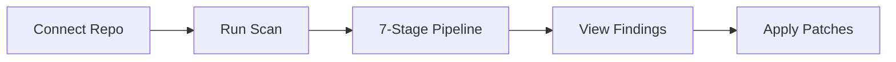

# Welcome to Heimdall

Heimdall is an AI-powered security scanner that goes beyond pattern matching to discover real vulnerabilities in your codebase. It builds a threat model of your application, deploys AI agents that reason about your code, validates findings in a sandboxed environment, and produces ranked vulnerabilities with patches and proof-of-concept exploits.

<CardGroup cols={2}>
  <Card title="Quick Start" icon="rocket" href="/quickstart">
    Get Heimdall running in minutes
  </Card>
  <Card title="How It Works" icon="gears" href="/how-it-works">
    Understand the 7-stage scan pipeline
  </Card>
  <Card title="Architecture" icon="diagram-project" href="/architecture">
    Explore the technical architecture
  </Card>
  <Card title="API Reference" icon="code" href="/api/authentication/register">
    Browse the REST API documentation
  </Card>
</CardGroup>

## Key Features

<CardGroup cols={2}>
  <Card title="AI-Powered Discovery" icon="brain">
    The Hunt agent reasons about your code like a security researcher, discovering vulnerabilities that pattern matchers miss
  </Card>
  <Card title="Automated Threat Modeling" icon="shield-halved">
    Tyr generates structured threat models identifying trust boundaries, attack surfaces, and sensitive data flows
  </Card>
  <Card title="Sandbox Validation" icon="docker">
    Garmr executes proof-of-concept exploits in isolated Docker containers to confirm real vulnerabilities
  </Card>
  <Card title="Automated Patches" icon="wrench">
    Generate unified diff patches for every finding, ready to apply directly to your codebase
  </Card>
  <Card title="Multi-Language Support" icon="code">
    Full AST parsing for Rust, Python, JavaScript, TypeScript, Go, and Java via tree-sitter
  </Card>
  <Card title="GitHub & GitLab Integration" icon="git-alt">
    Connect repositories via OAuth, trigger scans on push events, and sync findings to issues
  </Card>
</CardGroup>

## What Makes Heimdall Different

Traditional security scanners rely on pattern matching—they look for known anti-patterns and flag suspicious code. Heimdall takes a fundamentally different approach:

1. **Context-Aware Analysis** — Builds a complete code index with AST parsing, symbol tables, call graphs, and data flow analysis
2. **Threat Modeling** — Generates a structured threat model before scanning to focus on real attack surfaces
3. **Agentic Discovery** — Deploys AI agents that investigate your code iteratively, following data flows and reasoning about security implications
4. **Adversarial Verification** — Challenges each finding with Víðarr, an adversarial agent that tries to disprove vulnerabilities
5. **Sandbox Validation** — Executes exploits in Docker to confirm findings are real, not false positives

## How It Works

1. **Connect a repository** — GitHub OAuth, GitLab OAuth, public git URL, or zip upload
2. **Run a scan** — Manually triggered, the 7-stage pipeline executes automatically
3. **Review findings** — Severity-ranked vulnerabilities with code context, explanations, and patches
4. **Apply fixes** — Accept suggested patches as unified diffs or create repository issues

## Supported Languages

| Language | Grammar | Status |
|----------|---------|--------|
| Rust | tree-sitter-rust | Full |
| Python | tree-sitter-python | Full |
| JavaScript | tree-sitter-javascript | Full |
| TypeScript | tree-sitter-typescript | Full |
| Go | tree-sitter-go | Full |
| Java | tree-sitter-java | Full |
| Ruby | regex fallback | Basic |
| PHP | regex fallback | Basic |

## Tech Stack

- **Language** — Rust (2024 edition)
- **Web Framework** — Actix-web 4
- **Frontend** — HTMX + Tailwind CSS
- **Database** — PostgreSQL
- **AST Parsing** — tree-sitter
- **AI Providers** — Claude, OpenAI, Ollama (BYOK)
- **Sandbox** — Docker via bollard

## Get Started

<CardGroup cols={2}>
  <Card title="Installation" icon="download" href="/installation">
    Install Heimdall locally or with Docker
  </Card>
  <Card title="Configuration" icon="gear" href="/configuration">
    Configure AI providers and integrations
  </Card>
</CardGroup>
